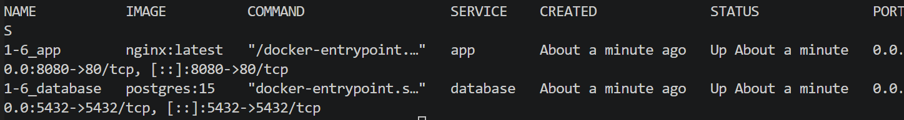
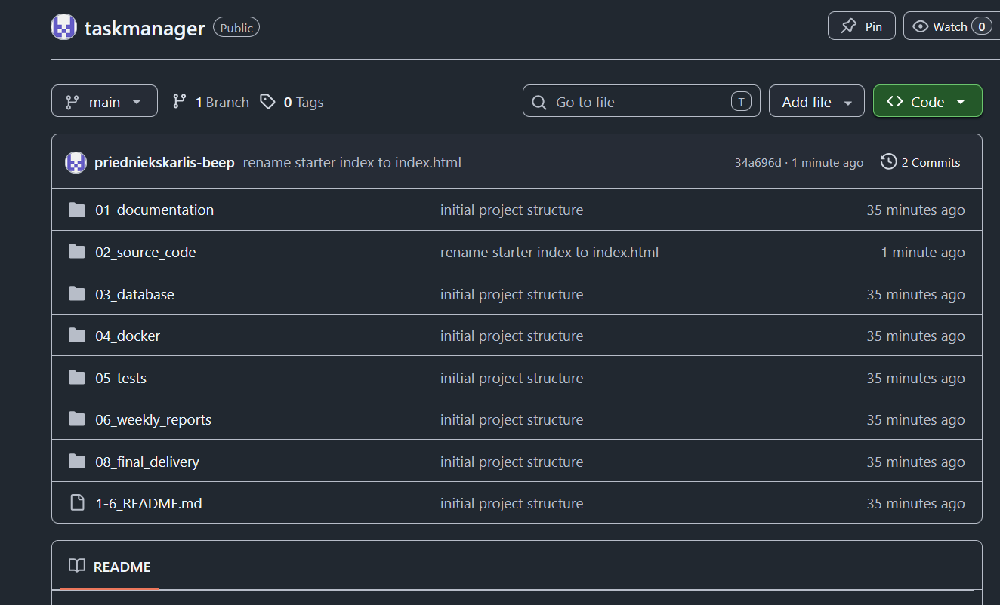
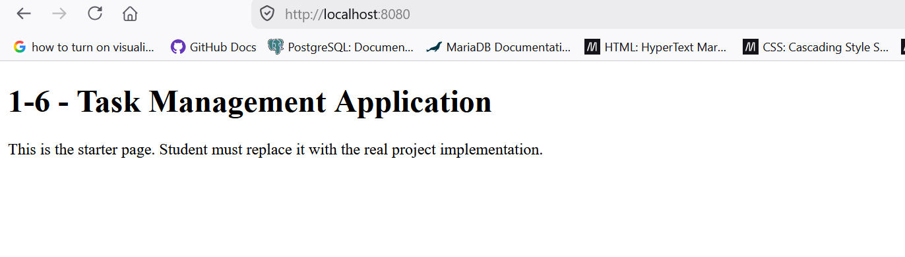
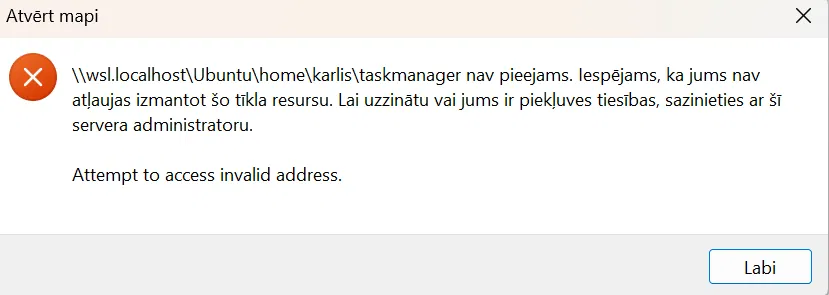
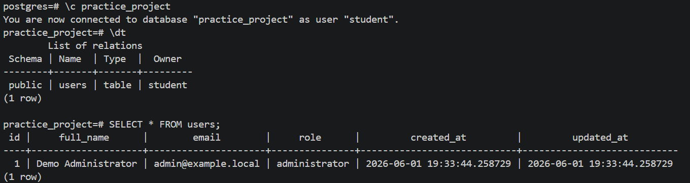
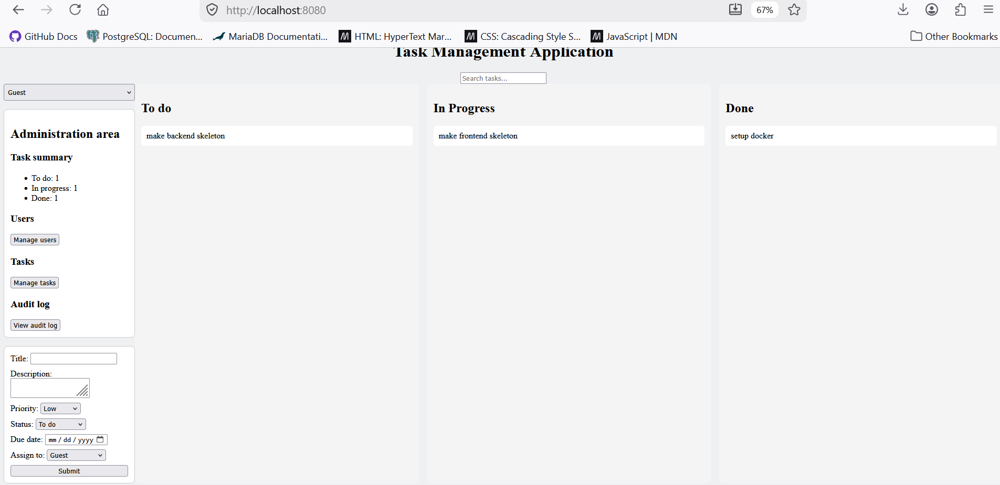

# 1-6 Weekly Report - Week 1

## Student Information

Student name: Kārlis Priednieks
Group: PX25
Project ID: 1-6
Project name: Task Management Application
Week number: 1

## Planned Work For This Week

Project setup, repository creation, requirements review, wireframes, database draft, Docker baseline.

## Completed Work
- Day 1: Repository setup, setting up and running Docker, getting the starter page to show up.
- Day 2: Wrote database code to implement users and tasks tables, and added starting data to them.
Checked the columns and the connection between tasks and users inside the database through terminal.
- Day 3: Created a git attributes file to convert line endings across Windows and Linux.
Created a wireframe. Completed the database verification, installation and documentation.
- Day 4: Fully wrote the README file for week 1 for project setup and overview. Created a .gitignore file for .env protection. Fixed the incomplete SQL schema and seed.
- Day 5: Wrote the initial HTML file in frontend.
- Day 6: Wrote the initial CSS file in frontend.
- Day 7: Expanded the frontend to match the wireframe sketch. Added an admin panel, reordered the task entry form fields and moved it to the bottom. Styled the sidebar with 3 boxes using a reusable CSS .panel class and a flexbox column layout, making the sidebar overseeable.

## GitHub Commits
https://github.com/priedniekskarlis-beep/taskmanager/commit/08a0c6f
https://github.com/priedniekskarlis-beep/taskmanager/commit/fca5ca8
https://github.com/priedniekskarlis-beep/taskmanager/commit/1febb81
https://github.com/priedniekskarlis-beep/taskmanager/commit/94d09c4
https://github.com/priedniekskarlis-beep/taskmanager/commit/ffbbc1a
https://github.com/priedniekskarlis-beep/taskmanager/commit/4cb21fb
https://github.com/priedniekskarlis-beep/taskmanager/commit/135a5f5
https://github.com/priedniekskarlis-beep/taskmanager/commit/c4efe05
https://github.com/priedniekskarlis-beep/taskmanager/commit/766de93
https://github.com/priedniekskarlis-beep/taskmanager/commit/29e4827
https://github.com/priedniekskarlis-beep/taskmanager/commit/a2e884b
https://github.com/priedniekskarlis-beep/taskmanager/commit/34a696d

## Screenshots / Evidence

docker_running.png - shows docker compose ps output

github_repo.png - shows files that are pushed to the GitHub repository

localhost_starter.png - shows the starter page at localhost:8080

wsl_error.png - shows WSL network error

database_running.png - shows the database schema running in docker

webapp_design.png - shows the current webapp ui design

## Problems Found
Access to the WSL network was blocked while connecting WSL to VS Code.
SQL commands weren't allowed with the database being up, because the system was trying to use the default system name (practice_project) instead of recognizing the name in the database configuration (student).
Updated CSS was not appearing in the browser because it was loading an old cached
copy of the stylesheet.

## Solutions Applied
Switching from Ubuntu to Windows with VSC.  
Used a explicit terminal command flag (specific instruction) '-U student' that signed-in manually rather than automatically and gave control and overview over the tables. 
Added a cache-busting query string (style.css?v=2) to force a fresh download, and
learned to use the browser DevTools "Disable cache" option while developing.

## Next Week Plan
Start creating the database and backend

## Supervisor Notes

