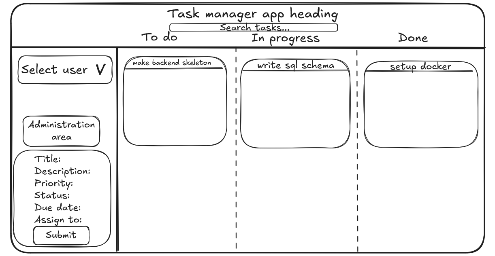

# Task Management Application

A Kanban-style web application for managing tasks with statuses, priorities, due dates, and user assignment.

## What This Project Does

- Displays tasks on a Kanban board with three columns: **To Do**, **In Progress**, and **Done**
- Lets users create, edit, and delete tasks
- Supports three user roles: Administrator, Standard User, and Guest
- Stores all data in a PostgreSQL database
- Runs entirely in Docker — no manual installation of Node, Python, or databases needed

## Wireframe



## Required Software

Before you start, install these two programs:

- [Docker Desktop](https://www.docker.com/products/docker-desktop/) — runs the app and database
- [Git](https://git-scm.com/) — downloads the project files

## Setup Instructions

### 1. Clone the repository

Open a terminal (in VS Code: `View → Terminal`) and run:

```bash
git clone https://github.com/priedniekskarlis-beep/taskmanager.git
cd taskmanager
```

### 2. Start Docker Desktop

Open Docker Desktop and wait until it shows **"Engine running"** in the bottom left corner.

### 3. Start the application

In your terminal, navigate to the docker folder and start the containers:

```bash
cd 04_docker
docker compose -f 1-6_docker-compose.yml up -d --build
```

### 4. Check it is running

```bash
docker ps
```

You should see two containers listed:
- `1-6_app` — the web server (nginx)
- `1-6_database` — the PostgreSQL database

### 5. Open the app

Go to [http://localhost:8080](http://localhost:8080) in your browser.

### 6. Stop the application

When you are done, stop the containers with:

```bash
docker compose -f 1-6_docker-compose.yml down
```

## Database

The project uses **PostgreSQL 15**.

Database name - `practice_project` 
Username - `student` 
Password stored in `.env` (not pushed to GitHub)
Port - `5432`

The database is initialised automatically when Docker starts. The SQL scripts in `03_database/` create the tables and load sample data — you do not need to run anything manually.

### Tables

**users** — stores people who can log in and be assigned tasks

| Column | Type | Description |
|---|---|---|
| id | SERIAL | Unique identifier (auto-generated) |
| full_name | VARCHAR(120) | Person's full name |
| email | VARCHAR(160) | Unique email address |
| role | VARCHAR(50) | `Admin`, `Standard User`, or `Guest` |
| password_hash | VARCHAR(255) | Hashed password (never stored in plain text) |
| created_at | TIMESTAMP | When the record was created |
| updated_at | TIMESTAMP | When the record was last changed |

**tasks** — stores the individual tasks shown on the Kanban board

| Column | Type | Description |
|---|---|---|
| id | SERIAL | Unique identifier (auto-generated) |
| title | VARCHAR(140) | Short task title |
| description | TEXT | Longer task details (optional) |
| status | VARCHAR(50) | `To do`, `In Progress`, or `Done` |
| priority | VARCHAR(50) | `Low`, `Medium`, or `High` |
| due_date | DATE | Deadline date (optional) |
| assigned_to | INT | Links to the `users` table (foreign key) |
| created_at | TIMESTAMP | When the record was created |
| updated_at | TIMESTAMP | When the record was last changed |

**audit_logs** — automatically records who changed what and when

| Column | Type | Description |
|---|---|---|
| id | SERIAL | Unique identifier |
| user_id | INTEGER | Which user made the change |
| action | VARCHAR(120) | What was done (e.g. `created`, `updated`) |
| entity_name | VARCHAR(120) | Which table was affected |
| entity_id | INTEGER | Which record was affected |
| created_at | TIMESTAMP | When the action happened |

## Project Structure

```
taskmanager/
├── 01_documentation/       # Project requirements and setup guides
├── 02_source_code/         # HTML, CSS, JavaScript source files
│   ├── frontend/           # index.html and static assets (served by nginx)
│   └── backend/            # API code
├── 03_database/            # SQL schema and seed data scripts
├── 04_docker/              # Docker Compose configuration
├── 05_tests/               # Test case documentation
├── 06_weekly_reports/      # Weekly progress reports
├── 07_screenshots_and_evidence/  # Screenshots of the running application
└── 08_final_delivery/      # Final report and delivery checklist
```

## Security Notes

- The `.env` file holds database credentials and is listed in `.gitignore` — it is **never** pushed to GitHub
- No real personal data is used — all database content is sample/mock data
- This project is for local learning only and must not be deployed to a public server

## Known Issues

- The backend API is not yet connected to the frontend (in progress)
- The user login system is planned but not yet implemented
